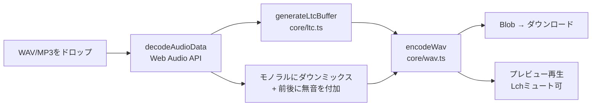
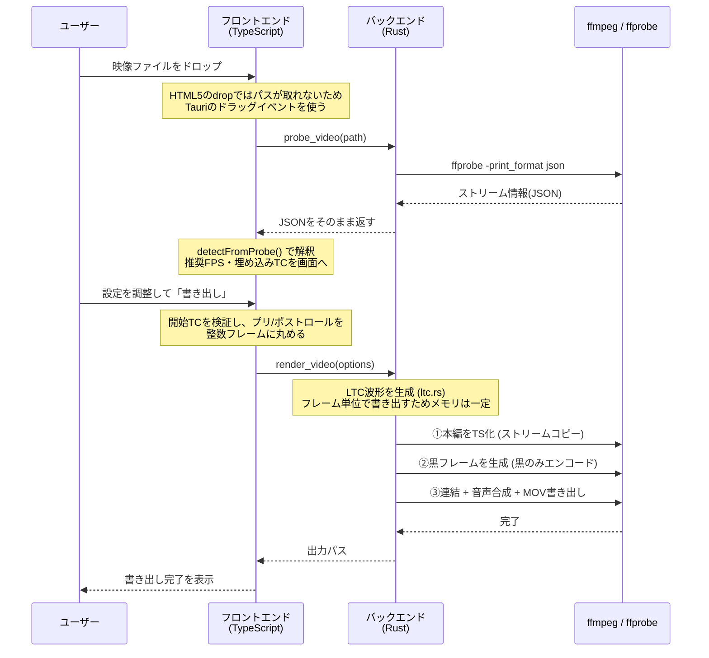
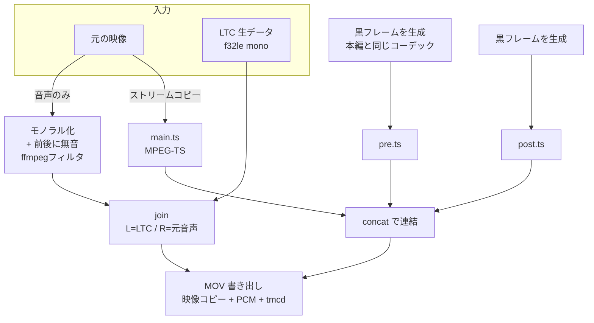

# TimecodeMix アーキテクチャ

音源・映像の **Lチャンネルにタイムコード(LTC)**、**Rチャンネルに元の音声** を載せて書き出すツール。
照明卓や同期機器へLTCを送る用途と、編集ソフトでのタイムコード同期の双方を想定している。

---

## 1. 全体像

同じ目的のアプリが2つあり、**扱えるメディアの種類で役割を分けている**。

| | Web版 | デスクトップ版 |
|---|---|---|
| 対応メディア | 音声のみ (WAV / MP3) | **映像** (MP4 / MOV) |
| 出力 | WAV (PCM) | MOV (PCM音声 + tmcdトラック) |
| 実行環境 | ブラウザ | Tauri (Rust + WebView) |
| 配布 | GitHub Pages / Vercel | USBメモリ等で配布 |
| インストール | 不要 | 必要 |

### なぜ2つに分けているか

映像をブラウザで扱えないため。ブラウザで動かすには ffmpeg.wasm が必要だが、
**入力ファイルを丸ごとメモリに載せる必要があり実用上1GB前後が上限**になる。

| 素材 | 10分あたりの容量 |
|---|---|
| ProRes 422 HQ (1080p) | 約 15〜16 GB |
| XAVC-I (4K) | 約 4〜5 GB |
| H.264 (配信用 1080p) | 約 0.5 GB |

収録マスターを投げた時点で破綻するため、映像はネイティブの ffmpeg を使えるデスクトップ版が担当する。
一方で音声だけの用途はブラウザで完結し、インストール不要という利点が大きいので Web版を残している。

---

## 2. リポジトリ構成

```
TimecodeMix/
├── index.html          Web版のUI
├── src/
│   ├── main.ts         Web版のUIロジック
│   └── style.css
├── core/               ★ Web版とデスクトップ版が共有する純粋ロジック
│   ├── ltc.ts          LTC信号の生成、タイムコードの相互変換
│   ├── wav.ts          WAVのエンコード / ヘッダ解析
│   └── video.ts        ffprobe出力の解釈、フレーム量子化
├── desktop/
│   ├── index.html      デスクトップ版のUI
│   ├── src/main.ts     デスクトップ版のUIロジック
│   └── src-tauri/
│       └── src/
│           ├── lib.rs      Tauriコマンドの定義
│           ├── ffmpeg.rs   ffmpeg / ffprobe の実行
│           └── render.rs   書き出しパイプライン
└── .github/workflows/  GitHub Pagesへのデプロイ
```

### Web版をルート直下に置いている理由

`packages/web/` のような構成にすると、**GitHub Pages のワークフローと Vercel の Root Directory 設定の変更が必要**になる。
現在稼働しているデプロイに手を入れずに共通化の目的を達成できるため、Web版はルートのまま `core/` を参照している。

---

## 3. `core/` — 共有される純粋ロジック

DOM にもファイルシステムにも依存しない。ブラウザ・Tauri・Node/Bun のいずれからも同じコードが動く。

### `core/ltc.ts`

| API | 役割 |
|---|---|
| `FRAME_RATES` | 対応フレームレートの定義(23.976 / 24 / 25 / 29.97 NDF・DF / 30 NDF・DF) |
| `frameToTimecode()` | 総フレーム数 → `HH:MM:SS:FF`。ドロップフレームの補正を含む |
| `parseTimecode()` | `HH:MM:SS:FF` → 総フレーム数。欠番フレームの指定も弾く |
| `formatTimecode()` | 表示用の文字列化。DFは `;` 区切り |
| `generateLtcBits()` | 1フレーム分の80ビットを生成(SMPTE 12M) |
| `generateLtcBuffer()` | LTC音声波形(Float32Array)を生成。Bi-phase Mark Code変調 |

**Web版のLTC生成はここが唯一の正。** デスクトップ版は性能上の理由で
Rust版(`desktop/src-tauri/src/ltc.rs`)を持つが、出力が一致することをテストで担保している(後述)。
デスクトップ版のフロントエンドも、入力値の検証と表示用の変換にはこのモジュールを使う。

### `core/wav.ts`

| API | 役割 |
|---|---|
| `encodeWav()` | L/Rの2chから16bit / 24bitのPCM WAVを生成 |
| `parseWavInfo()` | WAVヘッダからサンプリングレート・ビット深度を読む |

### `core/video.ts`

| API | 役割 |
|---|---|
| `detectFromProbe()` | ffprobeのJSONを解釈し、推奨FPS・埋め込みTC・警告を返す |
| `quantizeToFrames()` | 秒指定を整数フレームに丸める |

**フレームレートは有理数のまま比較する。** `30000/1001`(29.97)と `30/1`(30)は
小数に変換すると誤差で混同しうるが、分子・分母で比較すれば確実に区別できる。

**50 / 59.94 / 60fps は半分のTCに丸める。** LTCは30fpsまでしか規定が無いため。
この場合はその理由をUIに表示する。

**`quantizeToFrames()` が必要な理由**: 黒フレームは整数フレーム単位でしか作れない。
プリロール3秒を29.97fpsで素直に扱うと89.91フレームとなり、丸めた映像(90フレーム=3.003秒)と
音声(3.000秒)で尺が食い違う。先にフレーム数を確定し、そこから音声の長さを逆算することで一致させる。

---

## 4. Web版のフロー



すべてブラウザ内で完結し、サーバーへの送信は一切ない。

---

## 5. デスクトップ版のフロー

### 責務の分担

| レイヤ | 担当 |
|---|---|
| **フロントエンド** (TypeScript / WebView) | UI、設定値の検証、ffprobe出力の解釈 |
| **バックエンド** (Rust) | **LTC波形の生成**、ffmpeg / ffprobe の起動、書き出しパイプライン |

### LTCの生成をRustに置いている理由

当初はフロントエンド(`core/ltc.ts`)で生成していた。アルゴリズムを1箇所に保ちたかったためだが、実測すると成立しなかった。

| 尺 | TS生成 | base64変換 | 転送量 |
|---|---|---|---|
| 10分 | 0.09秒 | 2.04秒 | 146 MB |
| 60分 | 0.91秒 | **22.33秒** | **879 MB** |

**生成そのものは速く、ボトルネックは転送だった。** LTCは5つのパラメータだけで決まる決定論的なデータであり、
それを879MBに展開してプロセス境界を越えさせるのは本質的に無駄になる。

Rustで生成すると転送が消える。同じ条件の実測は以下の通り。

| 尺 | Rust生成 | 対TS比 |
|---|---|---|
| 1分 | 0.005秒 | 50倍 |
| 10分 | 0.051秒 | 42倍 |
| 60分 | **0.295秒** | **79倍** |

副次的に、チャンク分割・base64変換・テンポラリファイル管理用のコマンド2つがすべて不要になり、コード量はむしろ減った。

### 二重実装をどう管理しているか

Web版はTypeScript、デスクトップ版はRustと、LTCの実装が2つ存在する。
ドロップフレーム補正やパリティ計算は繊細なので、放置すれば必ず乖離する。

そこで **`matches_typescript_implementation` テスト** が両者の一致を担保している。
`core/ltc.ts` が生成したLTCのSHA-256を15パターン記録し、Rust版の出力と照合する。

検証条件には、全7フレームレート、ドロップフレームの10分境界、レベルの上下端、
44.1kHz / 96kHz、24時間での繰り上がり、整数フレームで割り切れない尺を含む。

**片方だけ変更するとテストが落ちる。** 意図的にアルゴリズムを変える場合は、
`scripts/gen-reference-hashes.ts` で期待値を再生成する。

### 読み込みから書き出しまで



### Tauriコマンド一覧

| コマンド | 引数 | 返り値 | 用途 |
|---|---|---|---|
| `check_ffmpeg` | なし | バージョン文字列 | 起動時の環境確認 |
| `probe_video` | `path` | ffprobeのJSON | 解析。**解釈はせず素通し** |
| `render_video` | `options` | 出力パス | LTC生成から書き出しまで(別スレッド実行) |

`probe_video` が JSON を解釈せず素通しするのは、**判定ロジックを `core/video.ts` に一本化する**ため。
Rust側にも同じ判定を書くと二重管理になる。

---

## 6. 書き出しパイプラインの詳細



### 映像を再エンコードしない

本編の映像はストリームコピーで、**画質は完全に無劣化**。実測値は以下の通り(1080p / 20秒素材)。

| 方式 | 所要時間 |
|---|---|
| ストリームコピーのみ | 0.11 秒 |
| **黒だけエンコードして連結** | **1.19 秒** |
| 全体を再エンコード | 17.9 秒 |

プリロール / ポストロールを付けても、**黒の部分だけをエンコードすれば済む**。
黒は圧縮効率が極めて高いため、素材の長さに関係なくほぼ一定時間で終わる。

### MPEG-TSを経由する理由

MP4 / MOV では H.264 のパラメータセット(SPS/PPS)がコンテナ側に1つだけ保持される。
異なるエンコードのセグメントをそのまま連結すると、後続セグメントが先頭のパラメータで復号され破綻しうる。
MPEG-TS は各IDRフレームの直前にパラメータセットを埋め込むため、**セグメントごとに設定が違っても正しく復号される**。

### 音声をPCMで書き出す理由

LTCは矩形波(Bi-phase Mark Code)であり、**AAC等の非可逆圧縮をかけると立ち上がりが鈍ってLTCリーダーが読み取りに失敗する**。
MOVはPCMを標準でサポートし、Premiere / DaVinci Resolve / Final Cut のいずれでも問題なく扱える。

### タイムコードトラック(tmcd)

出力MOVには LTC(音声)とは別に **tmcdトラック** も書き込む。
これにより編集ソフトのタイムライン上でもタイムコードが表示される。
ストリームコピーのままコスト無しで付加できる。

| 経路 | 用途 |
|---|---|
| **Lch の LTC** | 照明卓・同期機器へXLRで送る |
| **tmcdトラック** | 編集ソフトでの確認 |

---

## 7. メモリとIPCの設計

デスクトップ版で長尺素材を扱うため、**音声データがプロセス境界を越えないよう**に設計している。

### LTCはRust側で生成し、直接ファイルへ書く

フレーム単位で書き出すため、**尺に関わらずメモリ使用量は一定**。
TypeScript側で一括生成すると60分素材で `Float32Array` だけで約700MB必要になり、
ブラウザ版を諦めたのと同じ理由で破綻する。

### 元音声はフロントエンドを経由させない

モノラル化・前後への無音付加・L/R結合はすべて ffmpeg 側のフィルタで行う。
フロントエンドが受け取るのは ffprobe のメタデータだけなので、**元音声が何GBあってもIPCには影響しない**。

### 結果としてIPCを通るのは設定値だけ

書き出し時にフロントエンドからRustへ渡るのは、入出力パス・フレームレート・
開始タイムコード・プリ/ポストロールのフレーム数といった**数十バイトの設定値のみ**になっている。

---

## 8. 制約と既知の注意点

| 項目 | 内容 |
|---|---|
| **プリ/ポストロール対応コーデック** | H.264 / HEVC / ProRes のみ。黒フレームを本編と同じ形式で作る必要があるため。それ以外は前後の付加を0にすれば処理できる |
| **可変フレームレート(VFR)** | スマホ撮影や画面収録で発生。検出して警告を出すが、正確な同期には固定フレームレートへの変換が必要 |
| **50 / 59.94 / 60fps素材** | LTCの規格上限が30fpsのため、半分のTCを割り当てる |
| **ffmpegの同梱** | 未実施。現在はシステムにインストールされた ffmpeg を使う |
| **アプリアイコン** | Tauriのデフォルトのまま |

### ffmpeg / ffprobe の解決順

1. 実行ファイルと同じディレクトリに同梱されたもの(配布時)
2. PATH上のもの(開発時)

---

## 9. セキュリティ上の判断

**Tauri の shell プラグインは使っていない。**
任意コマンドの実行を許可してしまうため、Rust側で `std::process::Command` を直接使い、
フロントエンドへ公開する操作を上記5つのコマンドだけに限定している。

Windows では子プロセス起動時に `CREATE_NO_WINDOW` を指定している。
指定しないと解析・書き出しのたびにコンソールウィンドウが明滅する。

---

## 10. テスト

| 対象 | 方法 |
|---|---|
| `core/` のロジック | フレームレート判定8パターン、フレーム量子化 |
| **`ltc.rs`** | **TypeScript版との出力一致(15パターン)**、ドロップフレームの欠番処理、シンクワードとパリティ、不正な入力の拒否 |
| `ffmpeg.rs` | ffprobeの存在確認、29.97の有理数判定、埋め込みTC読み取り、存在しないファイル |
| `render.rs` | 黒パディング付き書き出し、プリロールが黒く本編が残ること、パディング無し、音声トラック無し素材、非対応コーデックの拒否 |

Rustのテストは **ffmpeg自身にテスト素材を生成させる**ため、固定のテストファイルをリポジトリに置く必要がない。

```bash
cd desktop/src-tauri && cargo test
```

> テストは実際に不具合を検出した実績がある。テンポラリディレクトリをプロセス単位で共有していたため、
> **連続して書き出すと先に終わった処理が後続の作業ファイルごと削除する**状態だった。
> 手動確認では再現しにくく、発見が遅れていた可能性が高い。

---

## 11. 開発手順

### Web版

```bash
bun install
bun run dev        # http://localhost:3000
```

### デスクトップ版

必要なもの: Rust (MSVC) / Node / ffmpeg / WebView2

```bash
cd desktop
npm install
npm run tauri dev
```

### デプロイ

`main` への push で GitHub Actions が GitHub Pages へ自動デプロイする。
Vercel は `dev` ブランチのプレビュー用。
